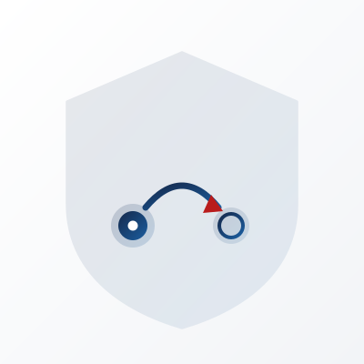

<p align="center">
  
</p>

# cA2A: Confidential Agent-to-Agent

### The secure, confidential profile for agent-to-agent (A2A) delegation

<p align="center">
  <a href="https://agentrust-io.github.io/ca2a">
    
  </a>
</p>

<p align="center">
  <strong>
    <a href="#quick-start">Quick Start</a> ·
    <a href="#how-it-works">Architecture</a> ·
    <a href="#the-cA2A-profile">Profile</a> ·
    <a href="CHANGELOG.md">Changelog</a>
  </strong>
</p>

[](https://github.com/agentrust-io/ca2a/actions/workflows/ci.yml) [](LICENSE) [](https://scorecard.dev/viewer/?uri=github.com/agentrust-io/ca2a)

[](https://pypi.org/project/ca2a-runtime/)

> **Developer Preview.** cA2A 0.2 ships the profile, offline verifier, enforced peer runtime, sealed channel, signed TRACE provenance, and fail-closed SEV-SNP, TDX, and TPM appraisal. It may still introduce breaking changes before 1.0. See [ROADMAP.md](ROADMAP.md) and [LIMITATIONS.md](LIMITATIONS.md) for the remaining hardware and interoperability work.

**cA2A (Confidential A2A) is the secure, confidential way to do agent-to-agent delegation on the [Agent2Agent (A2A)](https://a2a-protocol.org/) protocol.** It layers attested, attenuated delegation, a sealed peer channel, and an offline-verifiable provenance record on top of A2A, without replacing the transport. If you are looking for a secure version of A2A for multi-agent systems, this is the AgenTrust profile for it.

Agent A delegates a task to Agent B. B delegates part of it to C. Who authorized what? Did B stay inside the authority A actually held? Was the task payload readable by anyone between them? If a regulator asks, can you prove the answer for every hop?

---

## The problem

A2A won the agent-to-agent transport war. Its trust model stops at the front door.

The Signed Agent Card answers exactly one question: did the domain owner issue this card. It does not answer:

- **Integrity.** Is the peer running attested, unmodified, governed code, or a tampered agent wearing a valid card.
- **Authority.** When A delegates to B, does A actually hold the authority it is passing, and is B's grant a provable subset of it.
- **Confidentiality.** The task payload A sends B crosses a network and lands in B's memory. If B is in another trust domain, nothing seals that payload to B's attested measurement.
- **Provenance.** Across A to B to C, there is no unbroken, offline-verifiable chain of who delegated what to whom under which policy.

The runtime credential layer is explicitly left to implementers. The common answers today, mTLS and OAuth scopes, secure the pipe and assert an identity. They do not attenuate authority, attest runtime integrity, or seal payloads to a measurement. That gap is the union of identity, capability, and provenance.

cA2A closes it as a **profile on top of A2A**, not a competing transport.

---

## The cA2A profile

cA2A is a trust profile layered on A2A, the way TRACE binds to IETF RATS, EAT, and SCITT rather than reinventing them. It composes four primitives, each already partly built across the agentrust-io stack:

1. **Attenuated delegation.** Each hop carries a signed delegation credential whose scope is a provable subset of its parent. Child scope cannot exceed parent; depth is bounded; replay across chains is rejected. (Implemented in [agent-manifest](https://github.com/agentrust-io/agent-manifest).)
2. **Runtime attestation.** A peer proves it is running attested, measured code before it is trusted with a delegated task. (TEE provider abstraction shared with [cmcp](https://github.com/agentrust-io/cmcp).)
3. **Sealed peer channel.** The task payload is sealed to the peer's attested measurement, so it decrypts only inside the verified enclave. _(Channel encryption is implemented; binding the seal to a **verified** attested measurement on a live call is on the roadmap. Until that lands, do not assume a payload is confined to a specific measurement. See [LIMITATIONS.md](LIMITATIONS.md).)_
4. **Provenance record.** Each hop emits a TRACE record referencing the parent record hash and delegation credential id, producing an offline-verifiable delegation DAG.

---

## Quick Start

```bash
pip install ca2a-runtime
```

The same package supports both offline chain verification and the live peer runtime:

```bash
ca2a verify-chain --chain ./examples/minimal/chain.json
```

### See it refuse a call, and prove why

An agent asks for authority nobody delegated to it, is refused, and hands over a
record a third party checks offline without trusting the operator that produced it:

```bash
python examples/rejection-with-proof/demo.py
```

```
ALLOW  tool:search    effective scope ['tool:search']
DENY   tool:purchase  capability 'tool:purchase' is not in the effective scope
       requested   tool:purchase
       effective   ['tool:search']
```

```bash
ca2a verify-dag --dag examples/rejection-with-proof/dag.json \
                --chain examples/rejection-with-proof/chain.json
```

```json
{"verified": true, "records": 4, "outcome": "denied",
 "requested_capability": "tool:purchase", "effective_scope": ["tool:search"],
 "cross_checked": true}
```

The callee's own policy permits `tool:purchase`. It is refused anyway, because
the delegated scope does not carry it. See
[examples/rejection-with-proof/](examples/rejection-with-proof/) for what this
does and does not claim; it makes no attestation claim.

See [docs/quickstart.md](docs/quickstart.md) for the full walkthrough.

---

## How it works

```
Agent A --(delegation cred, scope S_A)--> Agent B --(scope S_B ⊆ S_A)--> Agent C
   |                                          |                             |
 TRACE record                            TRACE record                  TRACE record
 (root)                          (parent = hash(A), cred_id)     (parent = hash(B), cred_id)
                                          |
                              +-- verify chain: S_B ⊆ S_A ⊆ granted authority
                              +-- verify peer attestation measurement
                              +-- seal task payload to peer measurement
                              +-- intersect delegated scope with local policy (Cedar)
```

1. A holds a delegation credential granting scope `S_A`. To hand work to B, A issues a child credential with scope `S_B ⊆ S_A`, signed over the RFC 8785 canonical form of the grant.
2. Before B accepts the task, the cA2A runtime verifies the chain (each hop's signature and attenuation), verifies B's attestation measurement, and intersects `S_B` with B's local Cedar policy.
3. The task payload is sealed to B's attested measurement, so only B's verified enclave can read it.
4. Each hop emits a TRACE record linking to its parent, producing a delegation DAG any verifier can check offline without trusting an operator.

> **Status:** all four steps are implemented and exercised end to end. Software mode is available for evaluation; hardware-backed assurance requires a supported platform and pinned trust policy. See [LIMITATIONS.md](LIMITATIONS.md) and [ROADMAP.md](ROADMAP.md).

---

## Relationship to the agentrust-io stack

| Project | Role in cA2A |
|---|---|
| [agent-manifest](https://github.com/agentrust-io/agent-manifest) | Signed, attenuated delegation chain (the hardest primitive, already built) |
| [cmcp](https://github.com/agentrust-io/cmcp) | TEE provider abstraction, Cedar policy engine, audit chain, sealed channel primitives |
| [trace-spec](https://github.com/agentrust-io/trace-spec) | TRACE record format; cA2A adds the A2A delegation-link profile |

---

## Standards alignment

| Standard | Coverage |
|---|---|
| A2A (Linux Foundation / AAIF) | cA2A is a profile bound to A2A v1.x, not a competing transport |
| OWASP Agentic AI Top 10 | Multi-agent delegation abuse, confused-deputy, provenance gaps |
| RATS/EAT RFC 9711 | Peer attestation evidence; TRACE record is an EAT |
| IETF SCITT | Transparency and provenance for the delegation DAG |

---

## Documentation

| Page | Description |
|---|---|
| [docs/quickstart.md](docs/quickstart.md) | Build and verify a delegation chain offline |
| [docs/concepts.md](docs/concepts.md) | How the four primitives compose |
| [docs/SPEC.md](docs/SPEC.md) | The cA2A profile specification |
| [docs/spec/delegation-chain.md](docs/spec/delegation-chain.md) | Attenuated delegation semantics |
| [docs/spec/threat-model.md](docs/spec/threat-model.md) | Adversary model and residual risks |

---

## Contributing

[CONTRIBUTING.md](CONTRIBUTING.md) · [GOVERNANCE.md](GOVERNANCE.md) · [Discussions](https://github.com/orgs/agentrust-io/discussions)

---

## License

MIT - see [LICENSE](LICENSE).
