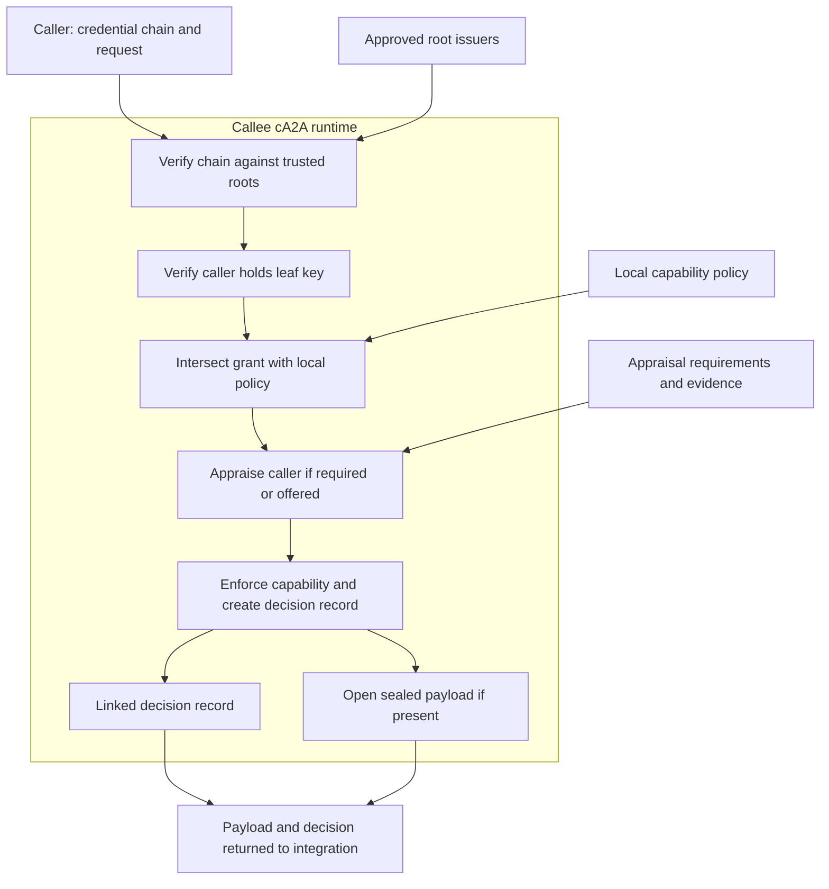

# How It Works

cA2A layers delegation and peer trust checks onto A2A communication. Start with the [offline chain example](quickstart.md) to see grant validation; the live runtime adds caller authentication, local policy, optional appraisal, and payload handling.

## The gap cA2A closes

A signed identity document does not establish every authority or runtime property needed for a delegated task. The relying party must decide which root issuers, capabilities, measurements, and evidence it accepts. See the [threat model](spec/threat-model.md).

## The four primitives

### 1. Attenuated delegation

Each child grant is signed by the parent subject and must narrow or preserve the parent's scope. Verification checks trusted roots, signatures, parent links, credential IDs, depth, and validity windows. A valid chain establishes a grant; it does not authenticate the caller currently presenting it. The live path separately checks proof of possession of the leaf key. See [delegation chains](spec/delegation-chain.md).

### 2. Runtime attestation

A provider produces evidence intended to bind a key to a measured runtime. The relying party must verify that evidence and apply its own measurement and assurance requirements. Software evidence does not establish hardware provenance. See [attestation](spec/attestation.md) and [limitations](../LIMITATIONS.md).

### 3. Sealed peer channel

The caller encrypts a payload to the callee's appraised channel key. Hardware isolation depends on the verified provider and key binding. In software mode, this does not protect the key or plaintext from a privileged host. See [sealed channels](spec/sealed-channel.md).

### 4. Provenance record

Linked TRACE records carry the decision and parent references. Verifiers check signatures and links separately from credential-chain validation. The offline grant example does not execute a task or establish a provenance DAG. See [the TRACE A2A profile](spec/trace-a2a-profile.md).

## How they compose on a peer call

The diagram follows the callee's inbound runtime checks. It shows the accepted path; a failed required check stops processing before payload opening.

Scroll the diagram horizontally on smaller screens. The text below explains the same boundaries.

Before sending a sealed payload, the caller must obtain and appraise the callee's channel offer. That outbound step and the callee's appraisal of the caller are distinct directions. The runtime box is a process boundary in software mode; verified confidential-computing deployments can add hardware isolation. The surrounding agents and their tools do not automatically move inside it.

The effective authority is the intersection of the delegated scope and local policy. Delegation cannot grant a capability that local policy refuses. Invalid chains or holder proofs are rejected before policy decisions and do not receive signed denial records; authenticated policy and appraisal denials have their own evidence behavior. See the [peer implementation](https://github.com/agentrust-io/ca2a/blob/main/src/ca2a_runtime/peer.py) for the exact ordering and failure paths.

## Profile, not protocol

The profile defines trust fields and checks. The reference HTTP transport makes the peer path runnable, and an A2A SDK bridge is also available. Transport choice does not establish hardware assurance or replace the relying party's trust policy.

Continue with [configuration](configuration.md), the [profile](spec/profile.md), or the [limitations](../LIMITATIONS.md).
