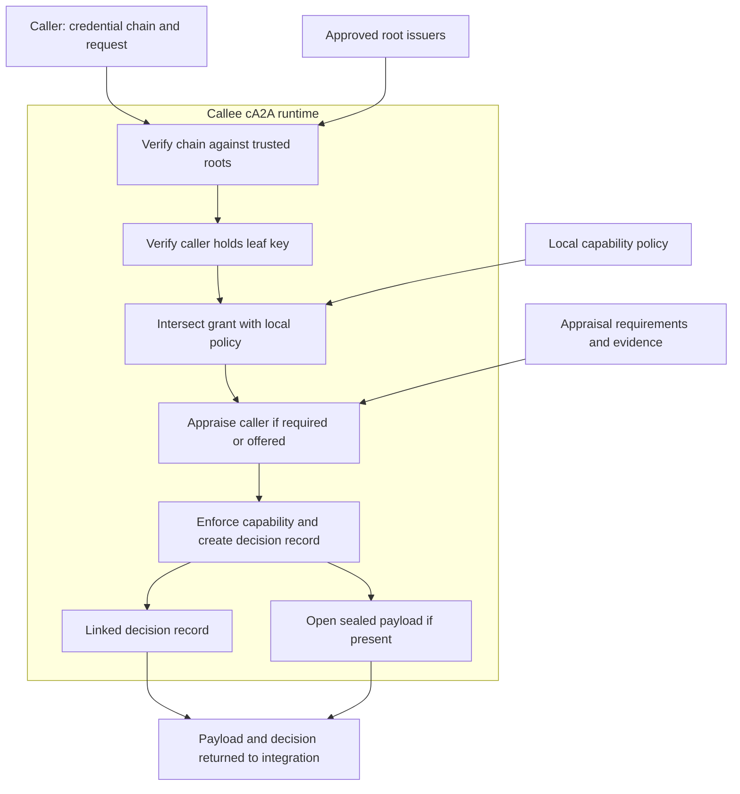

# How It Works

This page explains, in order, what cA2A checks when one agent hands work to another, and where each check's protection stops. Read it after the [offline chain example](quickstart.md), which shows the first check on its own. A live call between agents adds more: confirming who the caller is, applying the receiving agent's own rules, optionally checking hardware proof, and handling the encrypted task.

## The gap cA2A closes

A signed identity document says who an agent is. It does not say what that agent may do on someone else's behalf, or what software it is actually running. The agent receiving the work (the relying party) has to decide for itself which starting authorities, permissions, hardware measurements and evidence it accepts. The [threat model](spec/threat-model.md) lists the attacks this guards against.

## The four primitives

### 1. Attenuated delegation

"Attenuated" means the permission can only stay the same or get smaller at each handoff. Each child grant is signed by the agent that received the parent grant, and its scope (its list of permissions) must fit inside the parent's. The checker confirms the chain starts at a trusted root and that signatures, parent links, credential IDs, chain length and time windows are all valid.

A valid chain proves a grant was made. It does not prove that whoever is presenting it right now is the agent it was given to, so on a live call cA2A also asks the caller to prove it holds the final agent's private key. See [delegation chains](spec/delegation-chain.md).

### 2. Runtime attestation

Attestation is a report, signed by the processor, that says what software is running and ties the agent's encryption key to it. A provider (the part of cA2A that talks to TPM, AMD SEV-SNP or Intel TDX hardware) produces that report. The relying party checks it and applies its own rules about which measurements and how much assurance it requires. A report produced in software mode proves nothing about hardware. See [attestation](spec/attestation.md) and [limitations](../LIMITATIONS.md).

### 3. Sealed peer channel

The caller encrypts the task to a key the receiving agent (the callee) published and the caller checked, so only the holder of the matching private key can read it. Whether that key is protected by hardware depends on the hardware report that vouched for it. In software mode, an administrator of the machine could still read the key and the task. See [sealed channels](spec/sealed-channel.md).

### 4. Provenance record

Each handoff leaves a signed TRACE record of the decision, pointing back to the record before it, so the records together show the path the work took. Checking those records is separate from checking the permission chain. The offline grant example does not run a task or produce these records. See [the TRACE A2A profile](spec/trace-a2a-profile.md).

## How they compose on a peer call

The diagram follows the checks the receiving agent runs on an incoming call, in order. It shows the path when everything passes; a failed required check stops the call before the task is decrypted.

Scroll the diagram horizontally on smaller screens. The text below explains the same boundaries.

```mermaid
flowchart TB
    caller[Caller: credential chain and request] --> chain
    subgraph callee[Callee cA2A runtime]
        chain[Verify chain against trusted roots] --> holder[Verify caller holds leaf key]
        holder --> scope[Intersect grant with local policy]
        scope --> appraisal[Appraise caller if required or offered]
        appraisal --> decision[Enforce capability and create decision record]
        decision --> payload[Open sealed payload if present]
        decision --> record[Linked decision record]
    end
    roots[Approved root issuers] --> chain
    policy[Local capability policy] --> scope
    evidence[Appraisal requirements and evidence] --> appraisal
    record --> result[Payload and decision returned to integration]
    payload --> result
```

Before sending an encrypted task, the caller first fetches and checks the callee's key offer. That check (the caller checking the callee) is separate from the callee checking the caller. In software mode the runtime box in the diagram is just a separate process; on verified confidential-computing hardware it can also be hardware-isolated. The agents and tools around it do not move inside it automatically.

What the caller may actually do is the overlap of what it was delegated and what the callee's own rules allow. A delegation cannot grant something the callee's rules refuse.

??? info "Technical detail: denial records and ordering"
    Invalid chains or holder proofs are rejected before policy decisions and do not receive signed denial records; authenticated policy and appraisal denials have their own evidence behavior. See the [peer implementation](https://github.com/agentrust-io/ca2a/blob/main/src/ca2a_runtime/peer.py) for the exact ordering and failure paths.

## Profile, not protocol

cA2A is a profile: a set of extra fields and checks added to A2A messages. It does not replace A2A's way of sending messages. A small reference web server ships so you can run the whole path, and a bridge to the official A2A software development kit is also available. Which transport you use does not add hardware assurance or replace the relying party's own trust rules.

Continue with [configuration](configuration.md), the [profile](spec/profile.md), or the [limitations](../LIMITATIONS.md).
